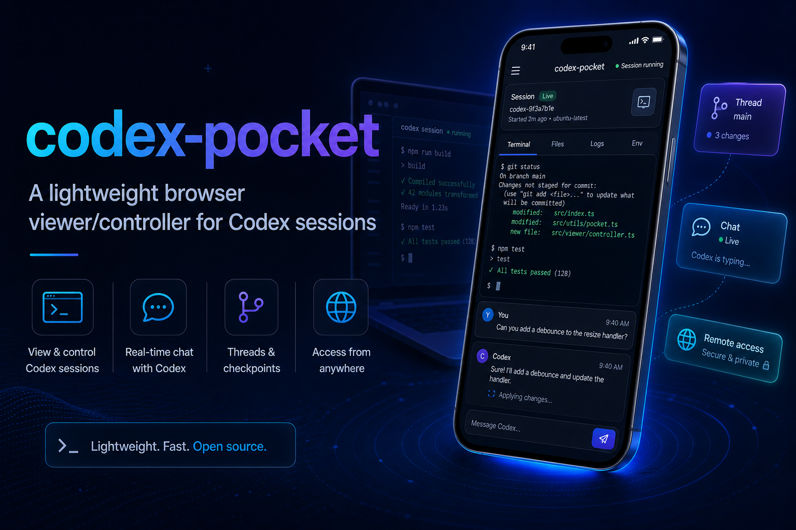

# codex-pocket 🫳📱



> A low-noise browser dashboard for triaging, reading, and lightly steering Codex work.

`codex-pocket` is not trying to be full remote desktop for Codex.
It is aiming to be the fastest way to scan many threads, read what matters, and send lightweight follow-ups from any browser.

Pick a thread, read the transcript, send short input, interrupt a turn, and use a few safe quick controls — without remoting an entire desktop.

---

## ✨ Why this exists

Sometimes you do **not** want full remote desktop.
You just want to:

- 👀 check what Codex is doing
- 🧵 switch between recent threads
- 💬 send a quick follow-up
- 🛑 interrupt a turn
- 📱 do all of that comfortably from a phone browser

That is exactly the shape `codex-pocket` is aiming for.

## 🎯 Product lens

If the official Codex app is best at **remote control**, `codex-pocket` wants to be best at:

- triage
- readability
- multi-thread oversight
- low-noise browser access
- safer limited exposure

---

## 🚀 What it can do

### Read
- 🧵 list recent Codex threads from local Codex state
- 📌 pin favorite threads locally for fast return trips
- 🔎 search / filter / sort by title, source, and project label
- 📖 render transcripts in a mobile-friendly collapsible view
- 🧠 semantic transcript view for request/answer-first reading
- 🚨 clearer blocked / waiting status cues for faster triage
- 🗂️ project-grouped thread view plus focus filters for larger dashboards
- 🔐 clearer read-only / restricted-review guidance for delegated browser users
- 🪶 expose a cleaner browser-facing thread/session model without leaking host absolute paths in normal API payloads

### Control
- ✍️ send text input into the selected thread
- 🛑 interrupt the active turn
- ⌨️ send quick terminal controls when Codex exposes a live stdin target
  - Enter
  - Escape
  - Ctrl+C

### UX
- 📱 designed for narrow/mobile screens first
- 🌐 built-in Korean / English UI toggle
- 🧠 browser-language detection + saved preference
- 🚨 attention digest for urgent thread triage
- 🕒 recent activity view for cross-thread scanning
- 🧭 first-pass multi-host/account browser switcher
- 📌 project-first navigation and sticky current-context view

### Local ops
- 🔐 optional local-user browser login with HTTP-only cookie sessions
- 📒 lightweight auth audit trail plus active browser-session visibility for owners/admins
- 🧰 local account/process CLI for repeatable setup and launch
- 👤 local user-management CLI for browser sign-in accounts, roles, modes, visibility scope, and delegated review boundaries

---

## 🧭 Quick mental model

`codex-pocket` has two sides:

### 1. Host machine 💻
A desktop machine that:
- runs Codex
- has access to `~/.codex`
- runs the local `codex-pocket` Node server

### 2. Client device 📱
Any browser-capable device that:
- opens the `codex-pocket` web UI
- can be a phone, tablet, laptop, or another desktop

> The browser never talks to Codex app-server directly. It only talks to `codex-pocket`.

---

## ⚡ Smallest useful flow

1. Run Codex on the host machine.
2. Start `codex-pocket`:

```bash
npm start
```

3. Optional but recommended for anything beyond pure localhost use:

```bash
npm run user:add -- <username>
```

4. Open:
   - same machine → `http://localhost:4782`
   - another trusted device → `http://<host-address>:4782`
5. Sign in if prompted.
6. Pick a thread and use the UI 🎉

If you want, you can switch the UI language from either:
- the toolbar
- the login screen

---

## 🛠️ More detailed startup notes

### Start the server

```bash
npm start
```

Or use the local account-aware CLI:

```bash
npm run onboard
npm run run
```

### Current defaults
- host bind: `127.0.0.1`
- browser port: `4782`
- Codex app-server listen URL: `ws://127.0.0.1:4791`

### Optional runtime override

```bash
CODEX_POCKET_HOST=127.0.0.1
```

### Enable browser login

Create a local user on the host machine:

```bash
npm run user:add -- <username>
```

Passwords are stored as **local password hashes** in `run/users.json`, not plain text.

---

## 🌍 Remote access

`codex-pocket` is **not** Tailscale-specific.

Any setup that lets a browser reach the host machine on the app port can work:

- `localhost`
- same LAN
- VPN / Tailscale / WireGuard / ZeroTier
- reverse-proxied private internal route

### Important detail
- the browser only needs access to the `codex-pocket` web port
- the Codex app-server itself can remain bound to `127.0.0.1`
- the default browser-facing port is `4782`
- LAN/VPN exposure requires an explicit host override because the safer default bind host is `127.0.0.1`

> Think: **“private reachability to one web port”**, not **“expose the whole Codex runtime.”**

---

## 🧪 Example access patterns

### 1. Same machine
- run `npm start`
- open `http://localhost:4782`

### 2. Another device on the same LAN
- run `codex-pocket` on the host desktop
- find the host LAN IP
- open `http://<host-lan-ip>:4782`

### 3. Remote device over VPN
- connect the client device to the same private network as the host
- open `http://<host-vpn-ip>:4782`

---

## 🧰 Local CLI commands

The project includes a small local CLI for repeatable setup, account switching, and preflight checks.

### Run the current/default account

```bash
npm run run
```

### First-time onboarding

```bash
npm run onboard
```

This creates local config under `run/accounts.json` (gitignored) and stores:
- bind host
- browser port
- `CODEX_HOME`
- Codex app-server listen URL
- Codex app-server URL

Browser login users are stored separately in `run/users.json` (also gitignored).

### Account commands

```bash
npm run account:add -- <account-name>
npm run account:remove -- <account-name>
npm run account:list
npm run account:show -- <account-name>
npm run account:set-default -- <account-name>
```

### User commands

```bash
npm run user:add -- <username>
npm run user:list
npm run user:remove -- <username>
npm run user:set-password -- <username>
npm run user:set-mode -- <username> <read_only|input_only|control>
npm run user:set-role -- <username> <member|admin|owner>
npm run user:set-projects -- <username> </allowed/project,/another/project>
npm run user:set-threads -- <username> <thread-id-1,thread-id-2>
npm run user:set-action-threads -- <username> <thread-id-1,thread-id-2>
npm run user:clear-scope -- <username>
```

### Access model at a glance

Browser access now has three layers:

- **role**
  - `owner` — full access, including role management
  - `admin` — can manage member access modes/scopes
  - `member` — no user management
- **permission mode**
  - `read_only` — triage/reading only
  - `input_only` — can send follow-up input, but not broader control actions
  - `control` — can use interrupt/terminal controls
- **visibility scope**
  - optional per-user `projectPrefixes` and `threadIds`
  - when set, the server only exposes matching threads/sessions
- **session-level action scope**
  - optional per-user `actionThreadIds`
  - when set, matching threads stay interactive while other visible threads become read-only in the session view

Example: create a low-risk triage account that can only see one project:

```bash
npm run user:add -- reviewer
npm run user:set-mode -- reviewer read_only
npm run user:set-projects -- reviewer /Users/song/Projects/codex-pocket
```

### Diagnostics

```bash
npm run print-env -- <account-name>
npm run doctor -- <account-name>
```

### Shared/internal deployment hardening knobs

```bash
export CODEX_POCKET_ALLOWED_ORIGINS="https://codex-pocket.example.com,https://pocket.internal"
export CODEX_POCKET_FORCE_SECURE_COOKIES=true
```

- `CODEX_POCKET_ALLOWED_ORIGINS` limits cookie-authenticated `POST` requests to specific browser origins
- `CODEX_POCKET_FORCE_SECURE_COOKIES=true` forces the session cookie to stay `Secure` behind HTTPS reverse proxies even if proxy headers are incomplete
- see `docs/deployment-hardening.md` for the fuller checklist and reverse-proxy notes

`doctor` checks things like:
- `CODEX_HOME` presence
- `state_5.sqlite` presence
- Codex app-server reachability
- bind host / browser port
- whether any local browser login users are configured

---

## 🏗️ Architecture at a glance

### Host side
Codex stores thread/session data under `~/.codex`.

A small local companion service handles:
- recent thread discovery
- rollout/transcript parsing
- browser API endpoints
- event-driven session updates
- input/control forwarding to Codex app-server

### Client side
**Phase 1**
- responsive web app / PWA-like flow
- compact thread picker
- transcript reader
- input bar + quick controls

**Phase 2**
- optional native wrapper/app
- saved hosts/sessions
- reconnect logic
- stronger auth and session management

For deeper notes:
- `docs/architecture.md`
- `docs/deployment-hardening.md`
- `docs/mvp-plan.md`
- `docs/next-steps.md`
- `docs/roadmap.md`
- `docs/1.1.0-prd.md`
- `docs/state-classification-design.md`

---

## 📦 Project structure

- `server/` — local companion server + CLI
- `web/public/` — browser UI
- `docs/` — architecture / planning / follow-up notes
- `run/` — local runtime config (gitignored)

---

## ⚠️ Current limitations

- built around Codex state under `~/.codex`
- read-side transcript rendering still depends on rollout/state parsing, not a fully semantic Codex thread model
- Enter / Esc / Ctrl+C only work when Codex exposes a live terminal stdin target for that thread
- mobile-friendly does **not** yet mean polished native-app quality
- auth/access control is still not hardened for direct public internet exposure

---

## 🔐 Security notes

- prefer `localhost`, LAN, VPN, Tailscale, or another trusted private route
- do **not** expose this prototype directly to the public internet without stronger auth, TLS, and operational hardening
- keep the Codex app-server bound locally when possible
- create at least one local browser login user before opening access beyond localhost
- browser login users are created locally on the Codex host via CLI; they are not self-service from the web UI
- use lower roles/modes plus optional visibility/action scope for shared/internal viewers instead of handing out full control by default
- browser-facing API payloads are intentionally reduced so normal thread/session reads do not expose host absolute paths like `cwd` or rollout file locations
- optional `CODEX_POCKET_ALLOWED_ORIGINS` lets you narrow which browser origins may issue authenticated `POST` actions
- optional `CODEX_POCKET_FORCE_SECURE_COOKIES=true` is useful behind HTTPS reverse proxies that do not reliably forward `X-Forwarded-Proto`
- anyone who can reach the web UI and satisfy auth may still inspect allowed transcripts and actions inside their granted scope, so treat network exposure carefully
- for a safer internal-exposure checklist, see `docs/deployment-hardening.md`

---

## 💡 Recommendation

Keep the browser-based version as the default surface first.
If it proves sticky and genuinely useful, wrap it later as a native mobile app instead of treating iPhone as the only target from day one.
